# ScrumPoker
Simple ScrumPoker application

## About
After trying to get our team to install a scrum poker app on the team's personal phones by our scrum master (which I also did not want to do), I had the idea to create a simple web app with websockets for a real-time vote. I also tried using vue.js to learn it.

## Screenshots
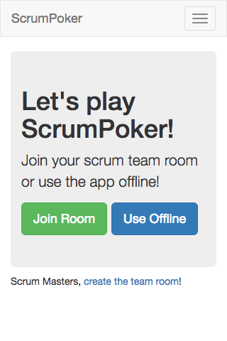
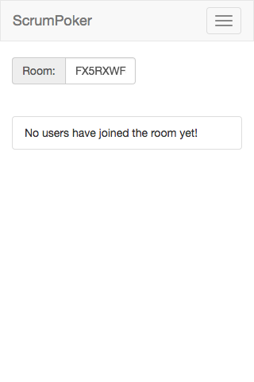
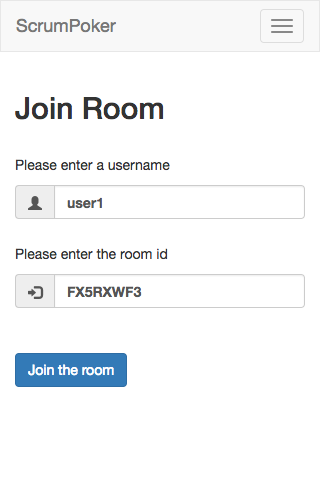
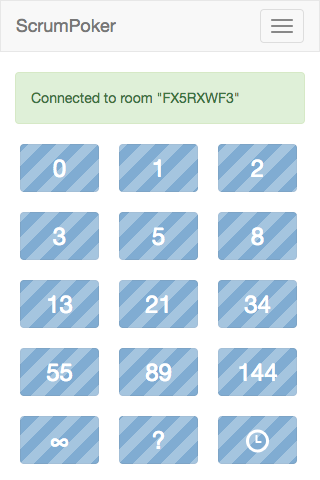
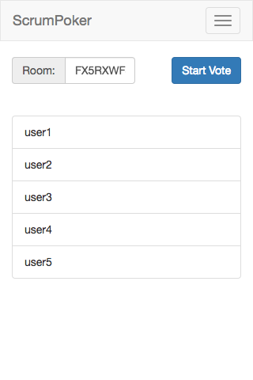
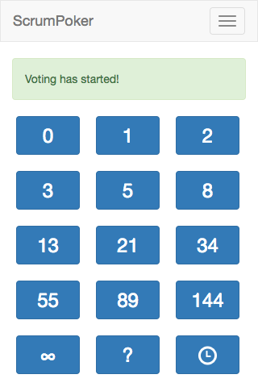
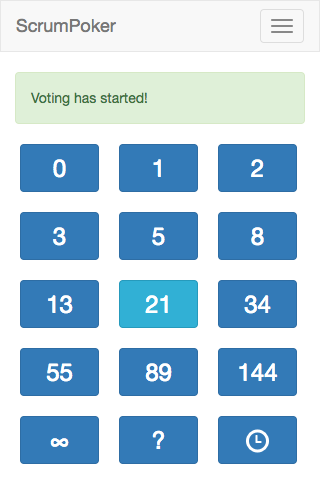
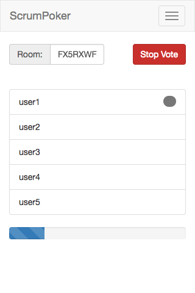
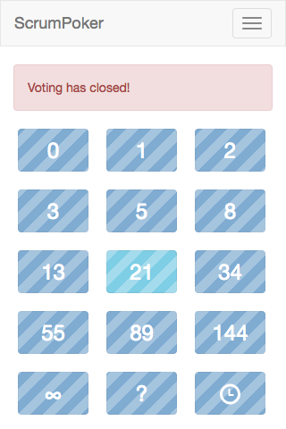
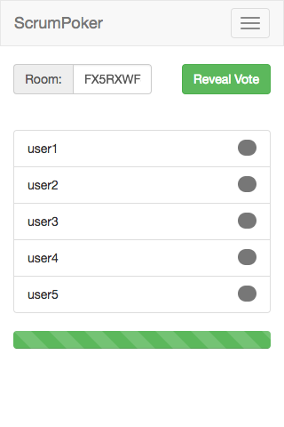
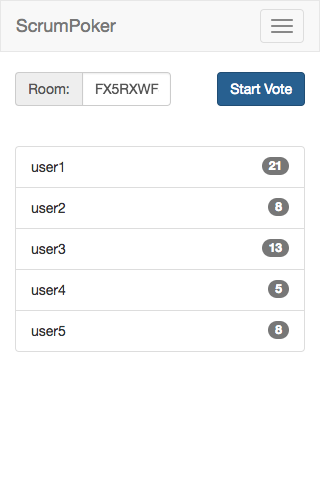
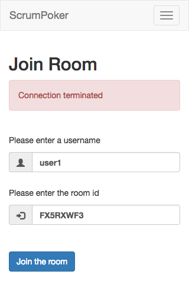
